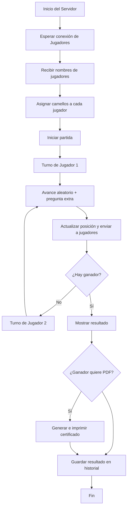
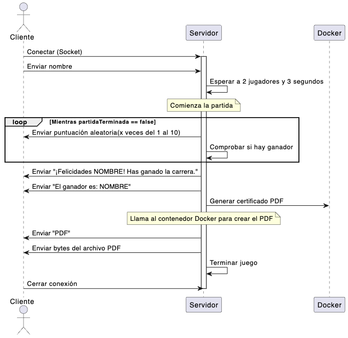
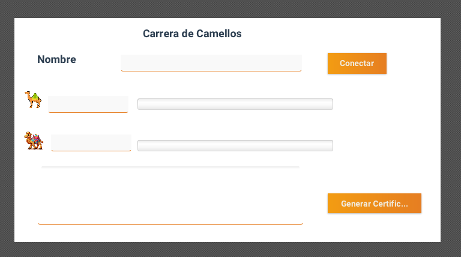

# Carrera de Camellos de Sara Martínez
## Repositorio Github https://github.com/Saykek/AppCamellos.git

## Hito 1 - Análisis y Prototipo

## - Análisis
- ### Reglas del juego:
  En el juego Carrera de Camellos participan 2 jugadores, cada uno de ellos . Cada jugador deberá registrarse con un nombre y una vez registrados empezará la carrear.. El camello que llegue primero será el camello ganador.
  Para avanzar los camellos lo harán de forma aleatoria. El ganador podrá generar un certificado PDF. Se registrarán las partidas.

- 
  
- ### Requisitos funcionales:
  - Permitir conexión.  
  - Permitir jugar.
  - Generar e imprimir un certificado del ganador.
  - Guardar las partidas y resultados.
  
  
- ### Requisitos No funcionales:
  - Conexión desde dos equipos diferentes.
  - Registro de dos jugadores con su nombre.
  - El sistema debe estar disponible cuando sea necesario.
  - El sistema debe ser sencillo y fácil de usar.
  - Interactuar a través de interfaz gráfica.
  - Avances extras a través de de preguntas.   
  - Guardar partidas y resultados de manera persistente.
  - Avanzar camellos de forma aleatoria.
  - Determinar el ganador e imprimir certificado PDF.
  
- ### Actores:

  - Usuarios
    - Se registrarán con su nombre, verán como avanzán tanto su camello como el del rival desde la interfaz gráfica y en caso de ganar podrá descargar el certificado.

- ### Casos de uso:
  
  - Jugar

#### Diagrama Casos de uso

_______________ 

## Hito 2 - Arquitectura, diseño y plan de pruebas
 El sistema sigue una arquitectura cliente-servidor con el patron MVC, donde 2 clientes se conectan al servidor a través de sockets TCP para participar en la carrera de camellos.
 Cada cliente mostrará su propia interfaz gráfica mediante JavaFX, donde se le permitirá registrarse con su nombre, seguir la carrera en tiempo real y en caso de ser ganador podrá descargar su certificado en PDF.
 En el servidor será donde se centralice toda la lógica del juego, incluyendo el registro de jugadores, los avances, el control del vencedor y  el almacenamiento de las partidas y  generación del certificado, que lo generará en markdown para después convertirlo a través de docker en PDF.

 ### Arquitectura Cliente - Servidor
 - Diagrama de despliegue: 
  

- Diagrama de componentes:

 
- ### Diagrama de flujo:
 

  - ### Protocolo de comunicación:
 - La conexión se hará con TCP
 - Se usarán hilos
 - El puerto será el 3009
 - Los mensajes serán tipo texto
 - Si un cliente pierde la conexión se anulará la partida.
  - 
- ### Protocolo de conexión
  
  - Los clientes se conectarán al servidor, podrán conectarse hasta 2 personas. Se registrarán enviando su nombre y se les asignará un camello.
  - Una vez que estén registrados los dos jugadores el servidor hará una breve pausa e irá asignando aleatoriamente valores del 1 al 10 a cada jugador.  Cuando un jugador llegue a la meta ( en mi caso he puesto llegar a 100 puntos)se dará por finalizada la carrera y se le generará al jugador vencedor el certificado PDF. Ambos jugadores recibirán un mensaje final recibiendo la enhorabuena o diciéndoles quien gano."
  

 - ### Tecnologías a usar:
  - Interfaz gráfica: La interfaz gráfica a utilizar será JavaFX con Scene Builder.
  - Comunicación: Se utilizarán socket TCP.
  - Programación: Se utilizará Java en Visual Studio Code.
  - Se utilizarán hilos para los jugadores y la lógica del juego.
  - Para la persistencia se usará un archivo de texto. 
  - Para la conversión de markdown a PDF se usará Docker.

- ### Desarrollo de la interfaz:
  
  - Se desarrollará con Scene Builder, será una interfaz sencilla donde se vayan mostrando los avances de cada camello en una barra de progresión. Tendrá un espacio para mostrar los mensajes y donde se pondrá la puntuación obtenida en cada turno. Tendrá un botón para generar el certificado pero solo se mostrará al ganador.
  Se mostrará todo en una única pantalla.

### - Prototipo

En esta fase muestro como será la estructura del proyecto y un prototipo de la pantalla.

### Estructura del proyecto

El programa esta organizado en dos proyectos, por un lado tenemos el cliente y por otro el servidor. Dentro de cada proyecto se organiza en paquetes.
Tanto en un proyecto como otro tenemos una estructura con MVC (aunque no disponemos de paquete vista en servidor), donde separamos responsabilidades.
En el servidor ademas tendremos un paquete llamado documentos para guardar todas las clases relacionadas con la generación de documentos, y además, guardaremos los certificados obtenidos. También contamos con paquete utilidades que será desde donde controlemos todos los logs. Fuera de esto tenemos otro paquete llamado documentacion con los diseños de los diagramas y la documentación sobre los proyectos. También se encuentra el fichero donde se guardan los log, el fichero donde se guardan las partidas, y un paquete más con las pruebas oportunas para los proyectos.
En el cliente mantenemos MVC, y este si que contiene los tres paquetes. Fuera tendremos la clase con la que pondremos en marcha el programa, un paquete llamado resources con los recursos utilizados y un paquete con todas las pruebas oportunas.

 

### Interfaz inicial (JavaFX)

Se ha diseñado un prototipo básico de la pantalla,arriba parte central tenemos el nombre del juego, debajo de esto permite que el jugador introduzca su nombre y se conecte al servidor, en la parte inferior a la derecha habrá un botón que sólo se mostrará en caso de resultar vencedor, donde podrá generar el certificado PDF, en el lado derecho de ésto hay una ventana donde se mostrarán los mensajes enviados por el servidor.

  

### Plan de Pruebas
#### ***Pruebas Manuales***
- He definido unas pruebas manuales para verificar que el juego funciona correctamente.

***Pruebas de funcionalidad***

  *Prueba 1: Conexión*
    •    Objetivo: Verificar que los dos clientes pueden conectarse correctamente al servidor.
    •    Procedimiento: Iniciar el servidor, luego conectar cada cliente.
    •    Resultado esperado: El servidor reconoce a los dos clientes y comienza la partida sin errores.

*Prueba 2 : Avance del juego*
    •    Objetivo: Comprobar que el servidor actualiza correctamente el avance de cada camello.
    •    Procedimiento: Iniciar una partida y dejar que avance automáticamente.
    •    Resultado esperado: El progreso de los camellos se muestra correctamente en cada cliente.

*Prueba 3 :  Fin de la partida y ganador*
    •    Objetivo: Verificar que se detecta el final de la partida.
    •    Procedimiento: Jugar hasta que uno de los camellos gane.
    •    Resultado esperado: Se muestra el ganador y se genera el certificado PDF.

*Prueba 4 : Fin de la partida*
Se deberá comprobar cuando un camello llega a la meta para mostrar quien es el ganador y generar el PDF.

***Pruebas de la interfaz***

*Prueba 1: Verificación botones*
    •    Objetivo: Asegurar que los botones funcionan como se espera.
    •    Procedimiento: Pulsar cada botón disponible en la interfaz en diferentes momentos.
    •    Resultado esperado: Se ejecutan las acciones esperadas sin errores.

*Prueba 2 : Imágenes*
    •    Objetivo: Comprobar que las imágenes de los camellos y la interfaz se cargan correctamente.
    •    Resultado esperado: Todas las imágenes se muestran bien en los clientes.

***Pruebas de mal funcionamiento***

*Prueba 1 : Más de 2 clientes*
    •    Objetivo: Ver qué ocurre si se intenta conectar un tercer cliente.
    •    Resultado esperado: El servidor no acepta más de 2 conexiones por partida y el tercero será dirigido a la siguiente partida.

*Prueba 2 : Cliente desconectado*
    •    Objetivo: Comprobar que el servidor detecta una desconexión.
    •    Procedimiento: Cerrar uno de los clientes durante una partida.
    •    Resultado esperado: El servidor informa de la desconexión y termina la partida.

#### ***Pruebas Automáticas***

- Se harán pruebas automáticas con JUnit para comprobar que funcionen bien la lógica de las clases, comprobando los métodos, que los errores se lancen cuando corresponde...
  Para ello tenemos la carpeta src/test donde se guardarán. 

*Prueba 1: Avances camellos*
    •    Objetivo: Verificar que el camello avanza correctamente según los puntos asignados.
    •    Método probado: .

*Prueba 2: Posición camellos*
    •    Objetivo: Comprobar que las posiciones se actualizan de forma coherente.
    •    Método probado: .

*Prueba 3: Datos del jugador*
    •    Objetivo: Verificar que los datos como nombre del jugador se asignan correctamente.
    •    Método probado: .

*Prueba 4: Generación de historial*
    •    Objetivo: Comprobar que al finalizar una partida se guarda correctamente el historial.
    •    Método probado: .

__________________

