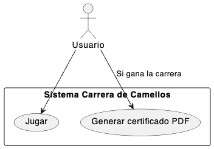
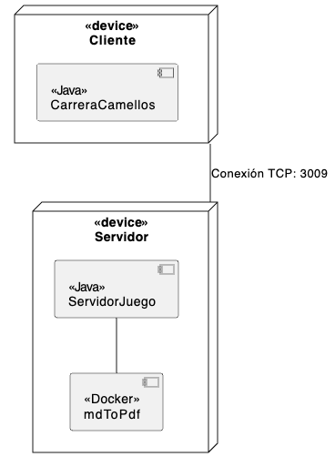
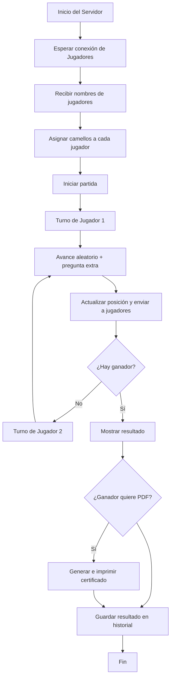

# Carrera de Camellos de Sara Martínez
## Repositorio Github https://github.com/Saykek/AppCamellos.git

## Hito 1 - Análisis y Prototipo

## - Análisis
- ### Reglas del juego:
  En el juego Carrera de Camellos participan 2 jugadores, cada uno de ellos . Cada jugador deberá registrarse con un nombre y una vez registrados empezará la carrear.. El camello que llegue primero será el camello ganador.
  Para avanzar los camellos lo harán de forma aleatoria. El ganador podrá generar un certificado PDF. Se registrarán las partidas.

- 
  
- ### Requisitos funcionales:
  - Permitir conexión.  
  - Permitir jugar.
  - Generar e imprimir un certificado del ganador.
  - Guardar las partidas y resultados.
  
  
- ### Requisitos No funcionales:
  - Conexión desde dos equipos diferentes.
  - Registro de dos jugadores con su nombre.
  - El sistema debe estar disponible cuando sea necesario.
  - El sistema debe ser sencillo y fácil de usar.
  - Interactuar a través de interfaz gráfica.
  - Avances extras a través de de preguntas.   
  - Guardar partidas y resultados de manera persistente.
  - Avanzar camellos de forma aleatoria.
  - Determinar el ganador e imprimir certificado PDF.
  
- ### Actores:

  - Usuarios
    - Se registrarán con su nombre, verán como avanzán tanto su camello como el del rival desde la interfaz gráfica y en caso de ganar podrá descargar el certificado.

- ### Casos de uso:
  
  - Jugar

#### Diagrama Casos de uso

_______________ 

## Hito 2 - Arquitectura, diseño y plan de pruebas
 El sistema sigue una arquitectura cliente-servidor, donde 2 clientes se conectan al servidor a través de sockets TCP para participar en la carrera de camellos.
 Cada cliente mostrará su propia interfaz gráfica mediante JavaFX.
 En el servidor será donde se centralice toda la lógica del juego.

 ### Arquitectura Cliente - Servidor
 - Diagrama de despliegue: 
  

- Diagrama de componentes:

 
- ### Diagrama de flujo:
 

  - ### Protocolo de comunicación:
 - La conexión se hará con TCP
 - Se usarán hilos
 - El puerto será el 3009
 - Los mensajes serán tipo texto
 - Si un cliente pierde la conexión se anulará la partida.
  - 
- ### Protocolo de conexión
  
  - Los clientes se conectarán al servidor, podrán conectarse hasta 2 personas. Se registrarán enviando su nombre y se les asignará un camello.
  - Una vez que estén registrados los dos jugadores el servidor hará una breve pausa e irá asignando aleatoriamente valores del 1 al 10 a cada jugador.  Cuando un jugador llegue a la meta ( en mi caso he puesto llegar a 100 puntos)se dará por finalizada la carrera y se le generará al jugador vencedor el certificado PDF. Ambos jugadores recibirán un mensaje final recibiendo la enhorabuena o diciéndoles quien gano."

 - ### Tecnologías a usar:
  - Interfaz gráfica: La interfaz gráfica a utilizar será JavaFX con Scene Builder.
  - Comunicación: Se utilizarán socket TCP.
  - Programación: Se utilizará Java en Visual Studio Code.
  - Se utilizarán hilos para los jugadores y la lógica del juego.
  - Para la persistencia se usará un archivo de texto. 

- ### Desarrollo de la interfaz:
  
  - Se desarrollará con Scene Builder, será una interfaz sencilla donde se vayan mostrando los avances de cada camello en una barra de progresión. Tendrá un espacio para mostrar los mensajes y donde se pondrá la puntuación obtenida en cada turno. Tendrá un botón para generar el certificado pero solo se mostrará al ganador.
  Se mostrará todo en una única pantalla.

### - Prototipo

En esta fase muestro como será la estructura del proyecto y un prototipo de la pantalla.

### Estructura del proyecto

El proyecto esta organizado en cuatro paquetes:
- **src/**
    - **cliente/** contiene las clases del cliente, la interfaz de usuario (JavaFX) y la lógica que gestiona la comunicación con el servidor.
    - **servidor/** contiene la lógica del juego, los hilos para gestionar múltiples jugadores, la verificación de respuestas y la generación de certificados.
    - **compartida/** contiene clases comunes que se utilizan tanto en el cliente como en el servidor para intercambiar información.
    - **recursos/** incluye los archivos .fxml, imágenes e iconos usados en la interfaz JavaFX.

 

### Interfaz inicial (JavaFX)

Se ha diseñado un prototipo básico de la pantalla,arriba parte central tenemos el nombre del juego. Arriba en el lado izquierdo permite que el jugador introduzca su nombre y se conecte al servidor o salga del juego, en la parte inferior podrá generar el certificado PDF si resulta ser ganador, y en el hueco que hay entre medias saldrá un mensaje al final de la partida. En el lado derecho muestra la posición del jugador, también saldrán las preguntas extras y se podrá contestar o no a ellas.

  

### Diseño del Sistema
El diseño será en paquetes, en principio habrá 4:
**src/**
    - **cliente/** contiene las clases del cliente, la interfaz de usuario (JavaFX) y la lógica que gestiona la comunicación con el servidor.
    - **servidor/** contiene la lógica del juego, los hilos para gestionar múltiples jugadores, la verificación de respuestas y la generación de certificados.
    - **compartida/** contiene clases comunes que se utilizan tanto en el cliente como en el servidor para intercambiar información.
    - **recursos/** incluye los archivos .fxml, imágenes e iconos usados en la interfaz JavaFX.

### Plan de Pruebas
#### ***Pruebas Manuales***
- He definido unas pruebas manuales para verificar que el juego funciona correctamente.

***Pruebas de funcionalidad***

  *Prueba 1: Conexión*
Iniciar el servidor y conectar los dos clientes.Comprobar que no hay ningún error de conexión.

*Prueba 2 : Envío y recepción de preguntas*
El servidor enviará una pregunta y deberá llegar al cliente sin problemas, este a su vez podrá contestarla y que la reciba el servidor.

*Prueba 3 : Verificación de respuestas*
El servidor recibirá la respuesta del cliente y deberá verificar si es correcta o no para actualizar la posición del camello.

*Prueba 4 : Fin de la partida*
Se deberá comprobar cuando un camello llega a la meta para mostrar quien es el ganador y generar el PDF.

***Pruebas de la interfaz***

*Prueba 1: Verificación botones*
Verificar que los botones tienen la funcionalidad deseada. Y se muestra todo lo incluido.

*Prueba 2 : Imágenes*
Verificar que se muestran correctamente todas las imágenes.

***Pruebas de mal funcionamiento***

*Prueba 1 : Clientes*
Intentar conectar más clientes de los permitidos(2).

*Prueba 2 : Desconexión*
Desconectar un cliente, el servidor debería detectarlo y finalizar la partida e informar al otro jugador.

#### ***Pruebas Automáticas***

- Se harán pruebas automáticas con JUnit para comprobar que funcionen bien la lógica de las clases, comprobando los métodos, que los errores se lancen cuando corresponde...
  Para ello tenemos la carpeta src/test donde se guardarán. 

*Prueba 1: Avances camellos*
Se comprobará que el camello avanza correctamente si responde bien, mal, o simplemente no responde. 

*Prueba 2: Posición camellos*
Comprobará la posición del camello para ver que es la esperada.

*Prueba 3: Datos*
Comprobará que los datos ( como el nombre del camello) es correcto

*Prueba 4: Respuestas*
Comprobará que las respuestas proporcionadas sean las correctas.

__________________

